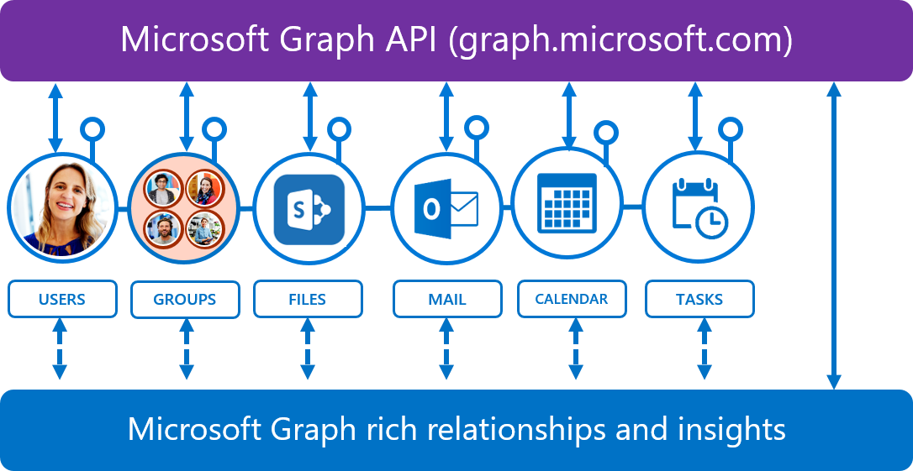
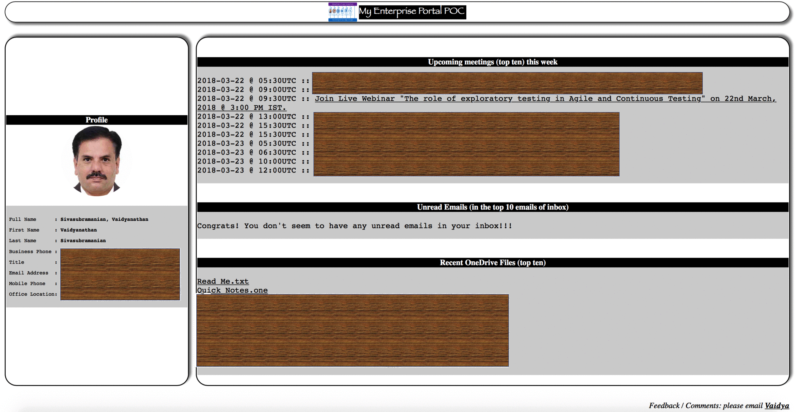

# My Enterprise Portal

  </img>

A POC of a productivity app to provide single page view of Office365 data like email / meetings / OneDrive Files using Microsoft Graph API.

To help me plan for the day ahead in the morning and quickly glance through the top ten things to focus on like unread emails / upcoming meetings / recent work files, wrote this small single page web app. Also, in every interaction with Service Desk the same set of profile data is needed by them to open a ticket, so added it too for easy copy & paste.

## Reference
The app utilizes the [Microsoft's Graph API](https://graph.microsoft.io) calls to fetch the O365 data.  The solution was built based on public GitHub repo of [Send Mail app](https://github.com/microsoftgraph/php-connect-rest-sample).  

## Technology stack
The app has been developed with PHP as the basic building block.  It has been deployed on an Azure VM with:
- Ubuntu 14.04
- Apache2
- PHP 7.2.2
- cURL 7.2.

Initial development and testing was done on a Mac.  The details provided in "Prerequisites", "Register and configure the app", "Configure and run the app" sections of the Readme in the public GitHub repo of [Send Mail app](https://github.com/microsoftgraph/php-connect-rest-sample) are exactly the same for this app.

## Deployment***
The app ~~is currently running on an Azure VM available [here](http://bit.ly/2BOtkVq)<b>***</b>.  A sample output is as below:~~

  </img>

<b>*** <i>The VM has been deprecated due to costs; a serverless solution has been deployed as detailed below.</i></b>

## Latest deployment
A serverless architecture solution with Django, Bootstrap 4 and Python has been deployed to Azure. The featureset remains same.  The Web App is available at .

## Security considerations
This app has "Security First" and "Privacy First" principles embedded:

- Authentication is with the Office365 integrated global SSO and added security of MFA.

- Bare minimum read only rights to the app to get email / calendar / OneDrive files.

- After rendering the web page on the client browser, all the session data at the server is destroyed. (In-fact that is the reason if browser refresh is actioned, re-authentication has to be completed).

- Browser cache control has been set to "No Cache" with an expiry date in the past.

- The security access token of the app expires in 10 minutes.

## Next Steps
Microsoft is positioning Graph API endpoint as the "one single cloud based access point to all of Office 365 data". It is indeed very interesting and powerful.  This app is just a POC.  If all the appropriate rights are made available to the app (most of them only an Office365 administrator can grant) a more interesting end state can be achieved as below:

  </img>

## Contact
Please reach out to [Vaidyanathan Sivasubramanian](mailto:svaidyan_signup@hotmail.com).
